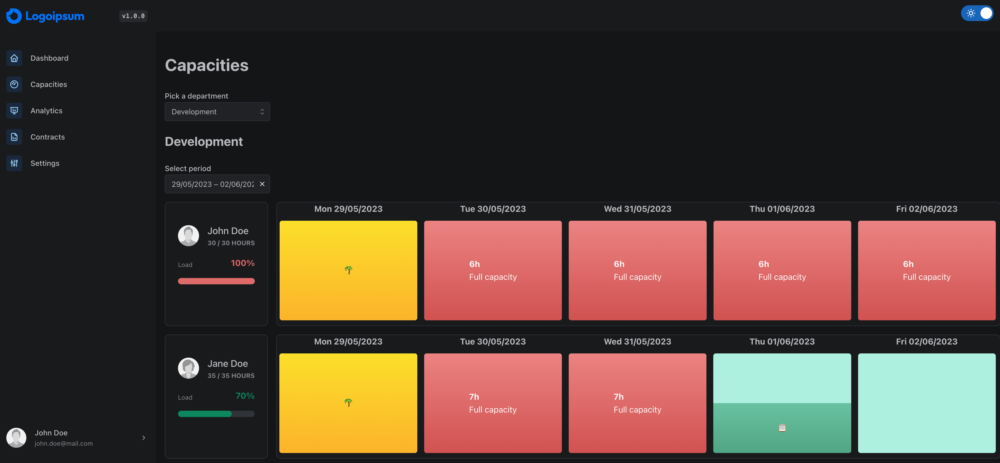

# About

This application was developed to display the data from [capacity-planning-backend](https://github.com/lorenzpfei/capacity-planning-backend)
in the frontend. You can find the more detailed documentation there.

The data is fetched from the backend via REST. The login is only available via OAuth so far.

# Getting Started

1. Follow the Getting Started in [capacity-planning-backend](https://github.com/lorenzpfei/capacity-planning-backend) for running the backend.
2. Create your Environment File `cp .env.example .env` and configure your data.
3. Run `yarn install`
4. Run `yarn start` for running the code locally (Default: [http://localhost:3000](http://localhost:3000)) or run `yarn build` to build a new version for deployment.

# Development

If you want to contribute to the project, you are welcome to do so. Known suggestions for improvement or bugs can be found in [Issues](https://github.com/lorenzpfei/capacity-planning-frontend/issues).

This project is using [Prettier](https://github.com/prettier/prettier) and [eslint](https://github.com/eslint/eslint). Please make sure your idea is using both or run `yarn all` instead after developing.

## Learn More

You can learn more in the [Create React App documentation](https://facebook.github.io/create-react-app/docs/getting-started).

To learn React, check out the [React documentation](https://reactjs.org/).
